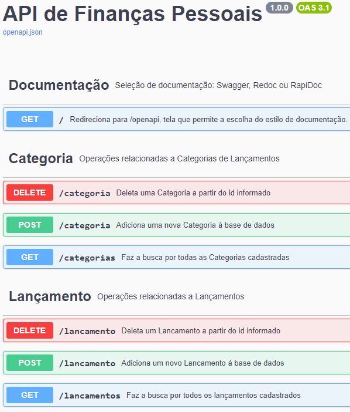

#  Finanças Backend API

## Sobre o projeto

O objetivo deste projeto é auxiliar no acompanhamento básico das finanças pessoais do usuário. O aplicativo possibilita a inclusão, remoção e listagem de receitas e despesas, mostrando um resumo do total das receitas e das despesas, junto com um saldo final.

Este projeto fez parte do MVP da Sprint 1 da Pós-Graduação da PUC-RJ.

### 🛠️Tecnologias Principais

<ul>
  <li>Python 3.12</li>
  <li>Flask 3.0.0</li>
  <li>SQLite</li>
  <li>SQAlchemy 2.0.23</li>
  <li>flask-openapi3 3.0.1</li>
</ul>

### 📑Regras de negócio

- Inserção, Listagem e Remoção de Categorias de Lançamentos
- Inserção, Listagem e Remoção de Lançamentos (receitas e despesas, conforme a categoria associada)
- Um Lançamento tem uma Categoria e uma Categoria pode ter vários Lançamentos
- 

### Endpoints

- User Endpoints

| URL / ENDPOINT | VERBO  | DESCRIÇÃO                    |
| -------------- | ------ | ---------------------------- |
| /categorias    | GET    | Retorna todas as Categorias  |
| /categoria     | POST   | Cria uma Categoria           |
| /categoria     | DELETE | Remove uma Categoria         |
| /lancamentos   | GET    | Retorna todos os Lançamentos |
| /lancamento    | POST   | Cria um Lançamento           |
| /lancamento    | DELETE | Remove um Lançamento         |


## Instruções de Uso

Seguem as instruções para a instalação, configuração e uso da aplicação.

### Instalação

1. Clone do repositório

```sh
   git clone git@github.com:marcelo-monte/puc-rj-mvp-sprint1-backend.git
   cd puc-rj-mvp-sprint1-backend
```

2. Criar um virtual environment. Confira no link abaixo:

`https://virtualenv.pypa.io/en/latest/installation.html`

3. Instalando os pacotes

```sh
    pip install requirements.txt
```

4. Rodando a aplicação localmente

```sh
  (env)$ flask run --host 0.0.0.0 --port 5000
```

5. Rodando em modo de desenvolvimento

```sh
  (env)$ flask run --host 0.0.0.0 --port 5000 --reload
```

6. Abra a URL abaixo no browser para visualizar a documentação no Swagger

```
  http://localhost:5000/
```

## Exemplos de Uso no Swagger

- Lista das rotas no Swagger
<div align="center">
  
</div>
<br>

- Lista de Lançamentos (JSON)
<div align="center">
  
</div>
<br>

## Desenvolvedor

- [Github](https://github.com/marcelo-monte)
- [Linkedin](https://www.linkedin.com/in/marcelo-monte-fernandes/)